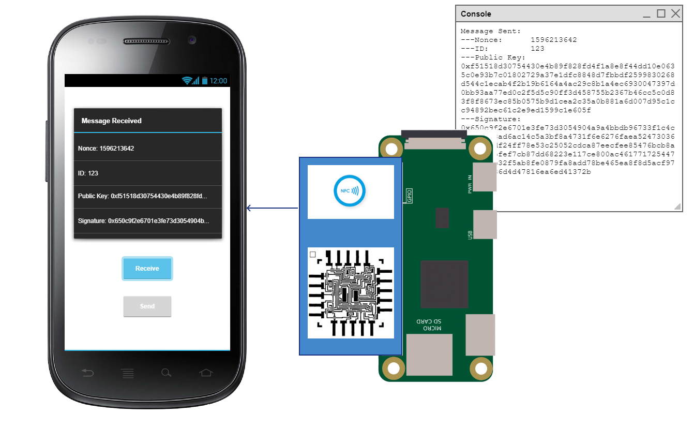
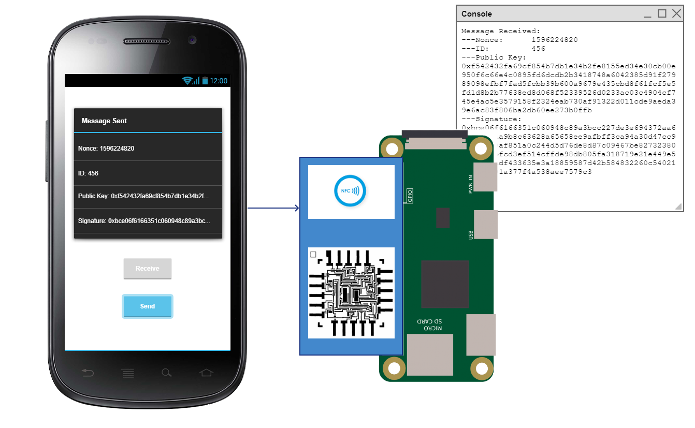

# NFC - Proof of Concept
Demonstrate exchange of messages and cryptographic signatures between an embedded system and a mobile device via NFC.

## Task
Build two small demo applications, one running on a Raspberry Pi Zero with attached NFC shield and one running on a NFC-capable Android mobile phone. Both applications need to be able to send and receive messages consisting of two unsigned integers (a nonce that is incremented for each message and a constant), RSA public key, and RSA signature of the two integers.

## Requirements

### Application 1
* Build using language and library of your choice, but will be tested on a Raspberry Pi Zero with attached PN532 NFC breakout board (working test hardware running libnfc with uart driver available)
* Runs continuously as a service/daemon
* Alternately sends and receives messages
* Content of received messages is written to standard output

### Application 2
* Android native app built using either Java or Mono/.NET MAUI (preferred)
* Compatible with Android 8
* Minimum user interface consisting of two buttons and text box
* Send button sends message that is received by Application 1
* Receive button reads message sent by Application 1 and displays content in text box

## Story

When I approach the NFC shield attached to the Raspberry Pi with my Android phone, a message should be received from the Raspberry Pi and displayed on the screen of the phone (may or may not require that user presses the "Receive" button of the Android app). 

While still in proximity of the NFC shield, pressing the "Send" button of the Android app triggers a message to be sent to the Raspberry Pi which is then printed to the standard output of the Raspberry Pi.

